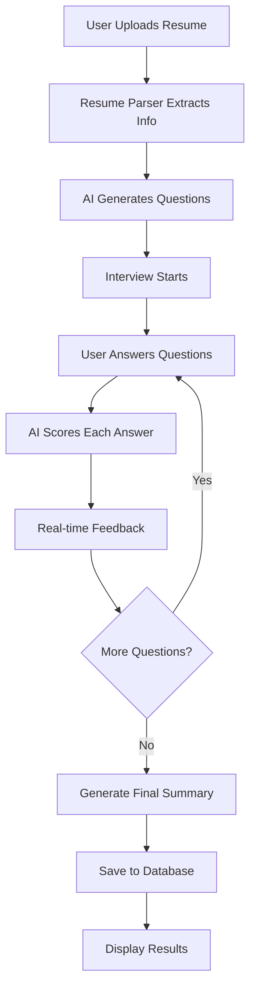
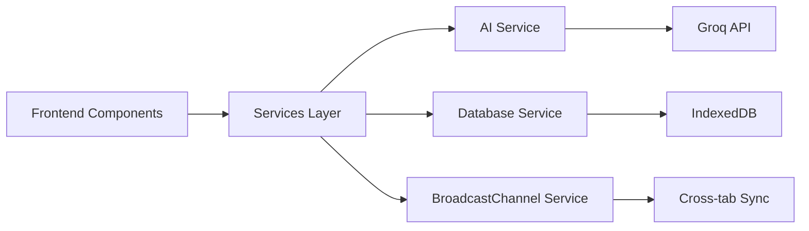

# 🚀 QuickInterview.ai

<div align="center">


**A comprehensive AI-powered interview platform with resume parsing, real-time scoring, and cross-tab synchronization**

[](https://reactjs.org/)
[](https://vitejs.dev/)
[](https://tailwindcss.com/)
[](LICENSE)

[Live Demo](#) • [Documentation](#documentation) • [API Reference](#api-reference) • [Contributing](#contributing)

</div>

---

## 📋 Table of Contents

- [✨ Features](#-features)
- [🛠️ Tech Stack](#️-tech-stack)
- [🚀 Quick Start](#-quick-start)
- [📖 Documentation](#-documentation)
- [🏗️ Architecture](#️-architecture)
- [🔧 Configuration](#-configuration)
- [📱 Usage](#-usage)
- [🧪 Testing](#-testing)
- [🚀 Deployment](#-deployment)
- [🤝 Contributing](#-contributing)
- [📄 License](#-license)

---

## ✨ Features

### 🎯 Core Functionality

- **🤖 AI-Powered Interviews**: Groq API integration with Llama 3.1 8B model for intelligent question generation and scoring
- **📄 Resume Parsing**: Automatic extraction of name, email, phone, and technical skills from PDF/DOCX files
- **⏱️ Timed Interview System**: 6 questions with progressive difficulty (Easy: 20s, Medium: 60s, Hard: 120s)
- **🔄 Real-time Cross-Tab Sync**: BroadcastChannel API for live updates between multiple browser tabs
- **💾 Data Persistence**: IndexedDB storage for candidates, chat history, and interview sessions
- **🔄 Session Recovery**: Automatic recovery for interrupted interviews

### 👤 Interviewee Experience

- **📤 Resume Upload**: Drag-and-drop interface with validation and parsing
- **📝 Missing Field Collection**: Smart prompts for incomplete information
- **⏰ Real-time Timer**: Visual countdown with auto-submit functionality
- **💬 Interactive Chat**: Question-by-question progression with immediate feedback
- **📊 Detailed Results**: Comprehensive scoring with strengths and improvement areas
- **🔄 Session Continuity**: Resume interrupted interviews seamlessly

### 📊 Interviewer Dashboard

- **👥 Candidate Management**: Search, sort, and filter candidate database
- **📈 Performance Analytics**: Real-time statistics and performance metrics
- **💬 Chat History**: Complete interview conversation logs
- **🤖 AI Insights**: Automated summaries and candidate analysis
- **🔄 Live Updates**: Real-time synchronization across multiple tabs
- **📊 Detailed Reports**: Question-by-question breakdown with scores

### 🎨 User Interface

- **📱 Responsive Design**: Optimized for desktop, tablet, and mobile devices
- **🎨 Modern UI**: Clean, professional interface with TailwindCSS
- **♿ Accessibility**: ARIA labels, keyboard navigation, and screen reader support
- **🌙 Dark Mode**: Optional dark theme support
- **⚡ Performance**: Optimized loading with skeleton components and lazy loading

---

## 🛠️ Tech Stack

### Frontend
- **React 18** - Modern React with hooks and concurrent features
- **Vite** - Fast build tool and development server
- **TailwindCSS** - Utility-first CSS framework
- **React Router DOM** - Client-side routing

### Backend Services
- **Groq API** - AI-powered question generation and scoring
- **IndexedDB** - Client-side database with idb wrapper
- **BroadcastChannel API** - Cross-tab communication

### File Processing
- **pdfjs-dist** - PDF parsing and text extraction
- **mammoth** - DOCX file processing

### Development Tools
- **ESLint** - Code linting and formatting
- **PostCSS** - CSS processing
- **Autoprefixer** - CSS vendor prefixing

---

## 🚀 Quick Start

### Prerequisites

- **Node.js** 16.0 or higher
- **npm** 7.0 or higher
- **Groq API Key** (optional, fallback questions available)

### Installation

1. **Clone the repository**
   ```bash
   git clone https://github.com/yourusername/QuickInterview.git
   cd QuickInterview
   ```

2. **Install dependencies**
   ```bash
   npm install
   ```

3. **Set up environment variables**
   ```bash
   cp .env.example .env
   ```
   
   Edit `.env` and add your Groq API key:
   ```env
   VITE_GROQ_API_KEY=your_groq_api_key_here
   ```

4. **Start development server**
   ```bash
   npm run dev
   ```

5. **Open your browser**
   Navigate to `http://localhost:5173`

### Production Build

```bash
npm run build
npm run preview
```

---

## 📖 Documentation

### Project Structure

```
src/
├── components/           # Reusable UI components
│   ├── Button.jsx       # Customizable button component
│   ├── Input.jsx        # Form input with validation
│   ├── Modal.jsx        # Modal dialog component
│   ├── ErrorBoundary.jsx # Error handling component
│   ├── Skeleton.jsx     # Loading skeleton components
│   └── WelcomeBackModal.jsx # Session recovery modal
├── features/
│   ├── interview/       # Interviewee functionality
│   │   ├── IntervieweePage.jsx    # Main interview page
│   │   ├── ResumeUpload.jsx       # Resume upload component
│   │   ├── InterviewChat.jsx      # Chat interface
│   │   ├── ChatMessage.jsx       # Individual message component
│   │   ├── TimerDisplay.jsx      # Timer visualization
│   │   ├── ProgressBar.jsx       # Progress indicator
│   │   └── InterviewSummary.jsx  # Results summary
│   └── dashboard/       # Interviewer functionality
│       ├── InterviewerPage.jsx    # Main dashboard page
│       ├── CandidateList.jsx     # Candidate table
│       └── CandidateDetails.jsx  # Individual candidate view
├── services/           # External services and APIs
│   ├── database.js     # IndexedDB operations
│   ├── broadcastChannel.js  # Cross-tab communication
│   └── aiService.js    # AI integration and scoring
├── utils/              # Utility functions
│   ├── resumeParser.js # Resume parsing logic
│   ├── timer.js        # Timer utilities
│   └── helpers.js      # General helper functions
├── App.jsx             # Main application component
└── main.jsx           # Application entry point
```

### API Reference

#### AI Service (`aiService.js`)

```javascript
// Generate interview questions
const questions = await aiService.generateInterviewQuestions(resumeText);

// Score an answer
const score = await aiService.scoreAnswer(question, answer);

// Generate final summary
const summary = aiService.generateFinalSummary({ candidate, questions, scores });
```

#### Database Service (`database.js`)

```javascript
// Candidate operations
await database.addCandidate(candidateData);
const candidate = await database.getCandidate(id);
const allCandidates = await database.getAllCandidates();

// Chat message operations
await database.addChatMessage(messageData);
const messages = await database.getChatMessages(candidateId);

// Session operations
await database.addInterviewSession(sessionData);
const session = await database.getInterviewSession(candidateId);
```

#### Resume Parser (`resumeParser.js`)

```javascript
// Parse resume file
const info = await resumeParser.parseResume(file);

// Get missing fields
const missing = resumeParser.getMissingFields(parsedInfo);

// Validate field
const isValid = resumeParser.validateField('email', 'user@example.com');
```

---

## 🏗️ Architecture

### Application Flow



### Data Flow



### Component Hierarchy

```
App
├── ErrorBoundary
├── Header (Navigation)
├── Routes
│   ├── IntervieweePage
│   │   ├── ResumeUpload
│   │   ├── InterviewChat
│   │   └── InterviewSummary
│   └── InterviewerPage
│       ├── CandidateList
│       └── CandidateDetails
└── WelcomeBackModal
```

---

## 🔧 Configuration

### Environment Variables

Create a `.env` file in the root directory:

```env
# Required: Groq API Configuration
VITE_GROQ_API_KEY=your_groq_api_key_here

```
### Customization

#### Styling
- Modify `tailwind.config.js` for custom colors and themes
- Update `src/index.css` for global styles
- Customize component styles in individual files

#### Interview Settings
- Adjust question counts and time limits in `aiService.js`
- Modify difficulty distribution in question generation
- Customize scoring criteria in fallback scoring

#### Database Schema
- Update `src/services/database.js` for schema changes
- Add new indexes for performance optimization
- Modify data validation rules

---

## 📱 Usage

### For Interviewees

1. **Start Interview**
   - Navigate to the Interviewee tab
   - Upload your resume (PDF or DOCX)
   - Complete any missing information if prompted

2. **Answer Questions**
   - Read each question carefully
   - Type your answer in the text area
   - Submit before time expires (auto-submit available)
   - Review AI feedback after each question

3. **View Results**
   - Review your overall score and rating
   - Read detailed feedback and suggestions
   - Download or print your results

### For Interviewers

1. **Access Dashboard**
   - Navigate to the Interviewer Dashboard tab
   - View real-time candidate statistics

2. **Manage Candidates**
   - Search candidates by name, email, or phone
   - Sort by score, name, or date
   - Click on candidates to view detailed profiles

3. **Review Interviews**
   - View complete chat history
   - Analyze AI-generated insights
   - Export candidate data for further analysis

---
